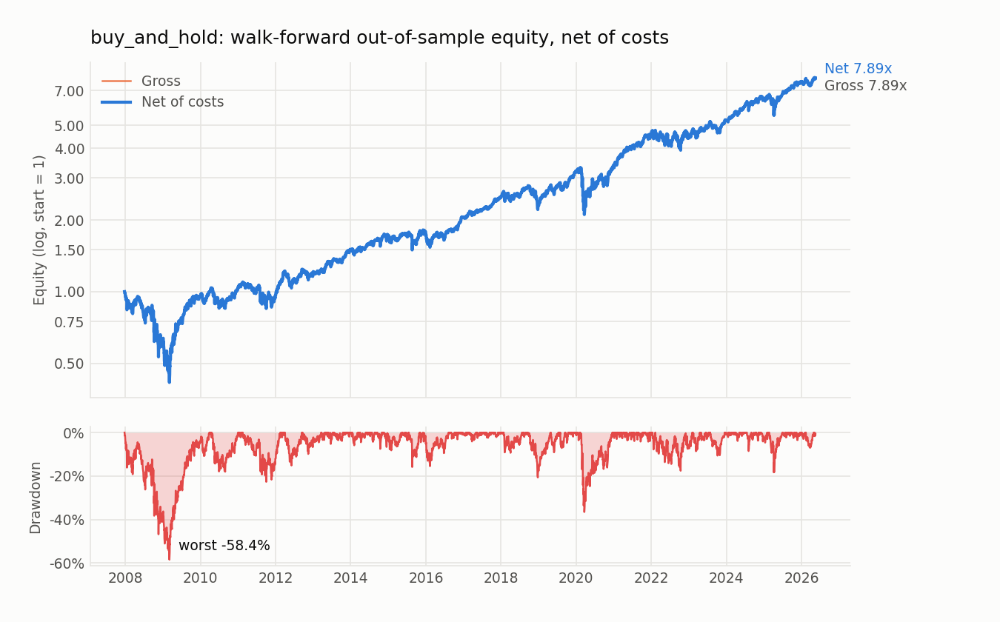
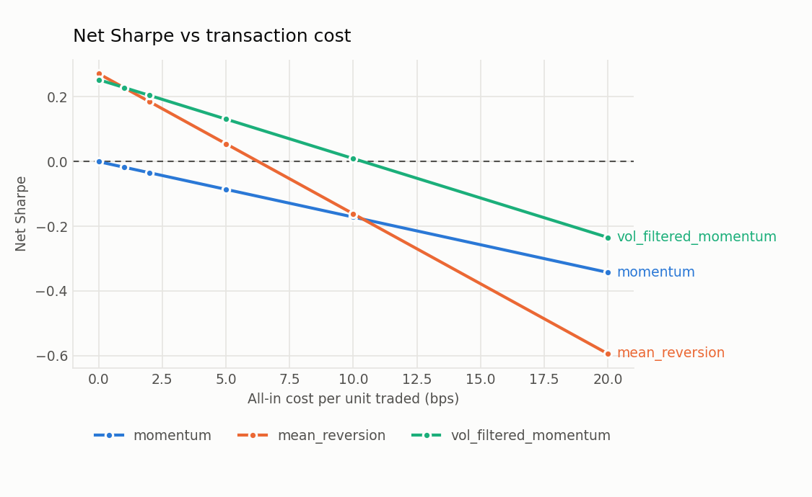
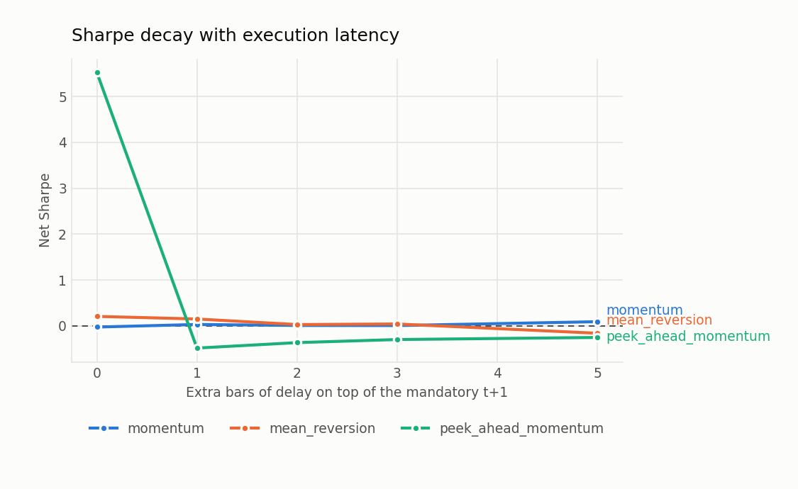

# Results

- data: `data_cache/bars.parquet`
- span: 2005-01-03 to 2026-09-10, 7 tickers, 5,456 bars
- costs: 1.50bp linear
- execution: decide at close t-1, fill at open t, mark out at open t+1
- risk-free rate assumed 0.0 in all Sharpe figures

## Full-sample summary (in-sample; NOT the result)

Shown for completeness and as a sanity check on the plumbing. The
number to quote is the walk-forward one below.

| strategy | sharpe | gross_sharpe | cagr | ann_vol | max_drawdown | calmar | turnover | exposure | hit_rate | n_trades | avg_cost_bps | n_periods |
| --- | --- | --- | --- | --- | --- | --- | --- | --- | --- | --- | --- | --- |
| buy_and_hold | 0.686 | 0.687 | 0.134 | 0.217 | -0.587 | 0.228 | 0.000 | 1.000 | 0.549 | 1 | 1.500 | 5456 |
| momentum | -0.026 | -0.000 | -0.016 | 0.154 | -0.473 | -0.033 | 0.085 | 0.989 | 0.520 | 5395 | 1.842 | 5456 |
| mean_reversion | 0.207 | 0.272 | 0.018 | 0.126 | -0.340 | 0.054 | 0.156 | 0.996 | 0.484 | 5433 | 2.070 | 5456 |
| vol_filtered_momentum | 0.216 | 0.253 | 0.017 | 0.106 | -0.270 | 0.065 | 0.081 | 0.962 | 0.502 | 5257 | 1.898 | 5456 |

## Walk-forward, out-of-sample only

| strategy | folds | oos_sharpe | oos_gross_sharpe | oos_cagr | oos_max_dd | turnover | exposure |
| --- | --- | --- | --- | --- | --- | --- | --- |
| buy_and_hold | 37 | 0.607 | 0.607 | 0.119 | -0.584 | 0.000 | 1.000 |
| momentum | 37 | -0.035 | -0.010 | -0.019 | -0.470 | 0.086 | 1.000 |
| mean_reversion | 37 | 0.246 | 0.308 | 0.024 | -0.342 | 0.158 | 1.000 |
| vol_filtered_momentum | 37 | 0.238 | 0.274 | 0.020 | -0.263 | 0.082 | 0.973 |

Per-fold detail for `buy_and_hold` (the spread across folds matters more than the mean):

| fold | train_bars | test_bars | sharpe | max_drawdown | turnover |
| --- | --- | --- | --- | --- | --- |
| 0 | 750 | 125 | -1.206 | -0.192 | 0.008 |
| 1 | 750 | 125 | -0.597 | -0.393 | 0.008 |
| 2 | 750 | 125 | 1.049 | -0.348 | 0.008 |
| 3 | 750 | 125 | 2.324 | -0.066 | 0.008 |
| 4 | 750 | 125 | 0.256 | -0.143 | 0.008 |
| 5 | 750 | 125 | 0.703 | -0.086 | 0.008 |
| 6 | 750 | 125 | -0.124 | -0.103 | 0.008 |
| 7 | 750 | 125 | -0.221 | -0.201 | 0.008 |
| 8 | 750 | 125 | 1.636 | -0.151 | 0.008 |
| 9 | 750 | 125 | 1.257 | -0.098 | 0.008 |
| 10 | 750 | 125 | 1.605 | -0.034 | 0.008 |
| 11 | 750 | 125 | 2.186 | -0.051 | 0.008 |
| 12 | 750 | 125 | 1.142 | -0.058 | 0.008 |
| 13 | 750 | 125 | 1.707 | -0.075 | 0.008 |
| 14 | 750 | 125 | 0.068 | -0.079 | 0.008 |
| 15 | 750 | 125 | 0.343 | -0.158 | 0.008 |
| 16 | 750 | 125 | -0.141 | -0.154 | 0.008 |
| 17 | 750 | 125 | 2.165 | -0.063 | 0.008 |
| 18 | 750 | 125 | 2.112 | -0.041 | 0.008 |
| 19 | 750 | 125 | 2.991 | -0.024 | 0.008 |
| 20 | 750 | 125 | 0.561 | -0.093 | 0.008 |
| 21 | 750 | 125 | 0.049 | -0.102 | 0.008 |
| 22 | 750 | 125 | 0.429 | -0.164 | 0.008 |
| 23 | 750 | 125 | 2.366 | -0.071 | 0.008 |
| 24 | 750 | 125 | -0.293 | -0.365 | 0.008 |
| 25 | 750 | 125 | 1.011 | -0.112 | 0.008 |
| 26 | 750 | 125 | 3.468 | -0.036 | 0.008 |
| 27 | 750 | 125 | 2.073 | -0.041 | 0.008 |
| 28 | 750 | 125 | -0.470 | -0.136 | 0.008 |
| 29 | 750 | 125 | 0.877 | -0.162 | 0.008 |
| 30 | 750 | 125 | 0.326 | -0.086 | 0.008 |
| 31 | 750 | 125 | 0.818 | -0.106 | 0.008 |
| 32 | 750 | 125 | 3.691 | -0.038 | 0.008 |
| 33 | 750 | 125 | 1.655 | -0.085 | 0.008 |
| 34 | 750 | 125 | 0.244 | -0.183 | 0.008 |
| 35 | 750 | 125 | 3.201 | -0.031 | 0.008 |
| 36 | 750 | 125 | 0.723 | -0.069 | 0.008 |

## Cost sensitivity

### momentum

| all_in_bps | sharpe_net | cagr | max_drawdown | turnover | annual_cost_drag |
| --- | --- | --- | --- | --- | --- |
| 0.000 | -0.000 | -0.012 | -0.470 | 0.085 | 0.000 |
| 1.000 | -0.018 | -0.015 | -0.472 | 0.085 | 0.002 |
| 2.000 | -0.035 | -0.017 | -0.474 | 0.085 | 0.004 |
| 5.000 | -0.086 | -0.025 | -0.508 | 0.085 | 0.011 |
| 10.000 | -0.172 | -0.038 | -0.609 | 0.085 | 0.021 |
| 20.000 | -0.343 | -0.063 | -0.764 | 0.085 | 0.043 |

Break-even all-in cost: beyond the tested grid.

### mean_reversion

| all_in_bps | sharpe_net | cagr | max_drawdown | turnover | annual_cost_drag |
| --- | --- | --- | --- | --- | --- |
| 0.000 | 0.272 | 0.027 | -0.334 | 0.156 | 0.000 |
| 1.000 | 0.228 | 0.021 | -0.338 | 0.156 | 0.004 |
| 2.000 | 0.185 | 0.015 | -0.343 | 0.156 | 0.008 |
| 5.000 | 0.055 | -0.001 | -0.405 | 0.156 | 0.020 |
| 10.000 | -0.161 | -0.028 | -0.569 | 0.156 | 0.039 |
| 20.000 | -0.594 | -0.079 | -0.835 | 0.156 | 0.079 |

Break-even all-in cost: **6.3 bps**

### vol_filtered_momentum

| all_in_bps | sharpe_net | cagr | max_drawdown | turnover | annual_cost_drag |
| --- | --- | --- | --- | --- | --- |
| 0.000 | 0.253 | 0.021 | -0.261 | 0.081 | 0.000 |
| 1.000 | 0.229 | 0.019 | -0.267 | 0.081 | 0.002 |
| 2.000 | 0.204 | 0.016 | -0.272 | 0.081 | 0.004 |
| 5.000 | 0.131 | 0.008 | -0.294 | 0.081 | 0.010 |
| 10.000 | 0.009 | -0.005 | -0.386 | 0.081 | 0.020 |
| 20.000 | -0.234 | -0.030 | -0.561 | 0.081 | 0.041 |

Break-even all-in cost: **10.4 bps**

### Break-even cost, out-of-sample

The table above is full-sample. This one re-runs the whole walk-forward
at each cost level, so the break-even is an out-of-sample figure.

| strategy | folds | sharpe_0bp | sharpe_5bp | sharpe_10bp | breakeven_bps |
| --- | --- | --- | --- | --- | --- |
| mean_reversion | 37 | 0.308 | 0.103 | -0.102 | 7.511 |
| vol_filtered_momentum | 37 | 0.274 | 0.155 | 0.036 | 11.517 |
| momentum | 37 | -0.010 | -0.092 | -0.173 | n/a |

## Latency sensitivity

Extra bars of delay ON TOP of the mandatory one. A signal whose Sharpe
falls off a cliff between 0 and 1 was reading something close to its own
fill price. `peek_ahead_momentum` is included as the positive control.

### momentum

| extra_lag_bars | sharpe_net | sharpe_gross | max_drawdown |
| --- | --- | --- | --- |
| 0 | -0.026 | -0.000 | -0.473 |
| 1 | 0.031 | 0.057 | -0.445 |
| 2 | 0.009 | 0.036 | -0.417 |
| 3 | 0.007 | 0.034 | -0.380 |
| 5 | 0.091 | 0.118 | -0.336 |

### mean_reversion

| extra_lag_bars | sharpe_net | sharpe_gross | max_drawdown |
| --- | --- | --- | --- |
| 0 | 0.207 | 0.272 | -0.340 |
| 1 | 0.150 | 0.216 | -0.338 |
| 2 | 0.029 | 0.096 | -0.361 |
| 3 | 0.042 | 0.111 | -0.346 |
| 5 | -0.161 | -0.088 | -0.519 |

### peek_ahead_momentum

| extra_lag_bars | sharpe_net | sharpe_gross | max_drawdown |
| --- | --- | --- | --- |
| 0 | 5.523 | 5.617 | -0.138 |
| 1 | -0.484 | -0.392 | -0.880 |
| 2 | -0.365 | -0.273 | -0.800 |
| 3 | -0.298 | -0.205 | -0.748 |
| 5 | -0.252 | -0.156 | -0.719 |

## Refit-cadence sensitivity

Out-of-sample Sharpe for `buy_and_hold` as the refit interval changes. Flat is
good news; a single lucky cadence is not a result.

| test_bars | n_folds | oos_sharpe | oos_max_dd | turnover |
| --- | --- | --- | --- | --- |
| 21 | 224 | 0.654 | -0.570 | 0.000 |
| 63 | 74 | 0.619 | -0.567 | 0.000 |
| 125 | 37 | 0.607 | -0.584 | 0.000 |
| 252 | 18 | 0.607 | -0.573 | 0.000 |

## Figures

